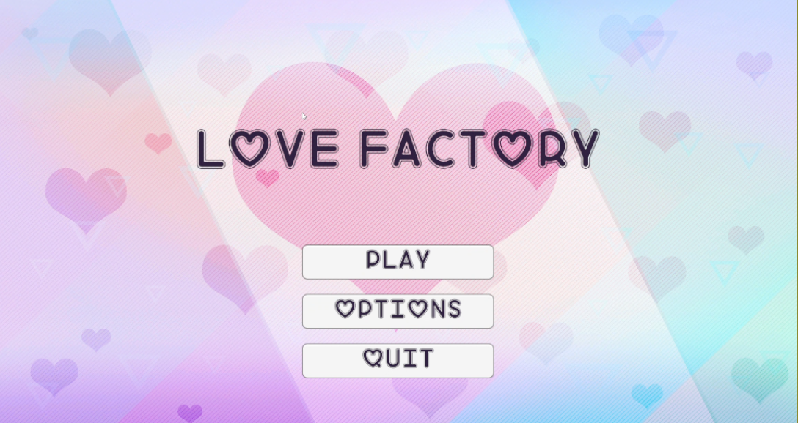
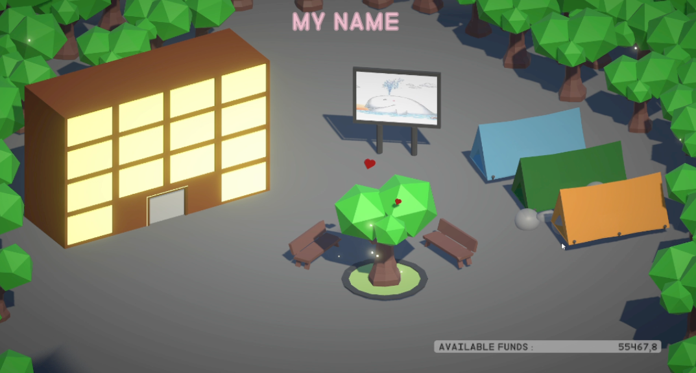
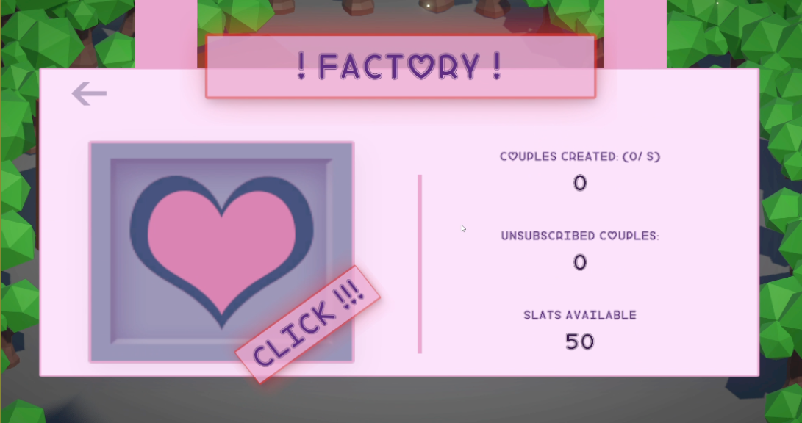

# Love Factory

Développement d'un jeu Unity s'insiprant das clickers comme Cookie Clicker où le but est de développer une économie.  
Développement des compétences en UI.  
Equipe de 2 développeurs.

## Description

Ce jeu est un petit jeu développé en une semaine avec 1 autre étudiant, visant à améliorer mes compétences en UI/UX principalement en interface utilisateur en réalisant ce clicker avec un maximum d'UI.

## Technologies utilisées

- C#
- Unity
- UI tools
- Git

## Captures d’écran

## Auteurs

Benjamin Benon [LinkedIn](https://www.linkedin.com/in/benjamin-benon-78b495194/)  
Timothé Imbert
